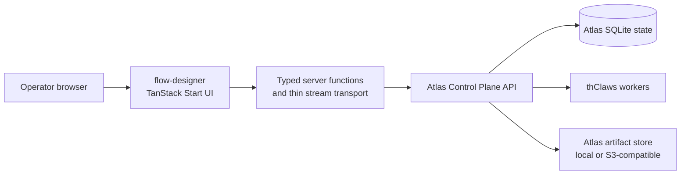

# Flow Designer architecture

Status: proposed implementation architecture

Date: 2026-07-19

## Decision

`flow-designer` is a frontend/client application for Atlas Control Plane. Atlas is the only domain backend and the only source of truth.



The transport layer is allowed to exist for secure cookies, SSR, CORS isolation, bearer forwarding, response normalization, and SSE proxying. It must not become a new domain backend.

## Ownership table

| Concern                             | Owner                          | Frontend responsibility                                                          |
| ----------------------------------- | ------------------------------ | -------------------------------------------------------------------------------- |
| Authentication and current identity | Atlas `/api/auth/*`, `/api/me` | Login UI, secure session transport, 401/403 states                               |
| Roles and permissions               | Atlas                          | Hide/disable actions based on identity, but always rely on Atlas for enforcement |
| Worker inventory and credentials    | Atlas                          | Forms, polling controls, display health/capabilities                             |
| Workspace mappings                  | Atlas                          | Lists and mutations                                                              |
| Jobs and conversations              | Atlas                          | Query, filters, details, actions, live output                                    |
| Workflow definitions                | Atlas                          | Canvas editing, serialization adapter, validation UI                             |
| Workflow execution                  | Atlas                          | Start/pause/resume/cancel/replay controls and progress display                   |
| Run/job events                      | Atlas                          | SSE connection, replay, dedupe, bounded rendering                                |
| Artifacts and deliveries            | Atlas                          | Metadata, download/open/retry UI                                                 |
| Triggers                            | Atlas                          | CRUD and fire controls                                                           |
| Audit and usage                     | Atlas                          | Filtering, pagination, export actions                                            |
| Persistence and migrations          | Atlas                          | None                                                                             |

## Data flow rules

1. Browser code never calls thClaws directly.
2. Browser code never imports `*.server.ts` (server-only clients, session helpers, secrets). It **may** import `*.functions.ts` — `createServerFn` wrappers are the client→server RPC boundary; the bundler strips the body and leaves a network call. Do not dynamically import server functions.
3. Components consume typed query results, not raw `fetch` calls and not Zustand domain state.
4. Atlas IDs, states, and error semantics are preserved in the transport layer.
5. UI-friendly derived values may be computed in selectors/mappers, but must not be persisted by the frontend.
6. A failed mutation must invalidate or reconcile the relevant query; it must not silently update only local state.

## Authentication boundary

Atlas authenticates with **opaque per-user bearer tokens only** — no JWTs and no session cookies (`atlas/app.py` `_is_authorized`; `atlas/db.py` `authenticate_api_token`). `POST /api/auth/login` verifies username/password and returns `{ token, user }`; `POST /api/auth/logout` revokes the token; `GET /api/me` returns `{ user: { id, username, role, status } }`. Roles are exactly `admin`, `operator`, `viewer`, `auditor` (`atlas/db.py` `ROLES`), enforced centrally in Atlas's dispatch, not per handler. The implementation target is:

```text
login form
  -> flow-designer server auth function (createServerFn)
  -> Atlas POST /api/auth/login
  -> Atlas bearer stored in a secure httpOnly cookie OWNED by flow-designer
  -> server functions read the cookie and forward Authorization: Bearer to Atlas
```

Because Atlas issues no cookie, the browser-facing session cookie is minted and owned by flow-designer. Do not store the Atlas token in `localStorage` or any browser-readable location. The cookie must be signed/encrypted and verified against the deployed TanStack Start runtime before coding; key management and rotation are configuration decisions (see `CONFIGURATION.md`).

Each private server function must **validate the session** and call a **typed, fixed Atlas operation** — a route `beforeLoad` only steers UI navigation and does not protect the directly-reachable RPC endpoint. Authorization itself stays with Atlas: the frontend does not reimplement RBAC, and role data is used only for UX gating (see the role→permission table in `BACKEND_INTEGRATION.md`). Because this repo defines `src/start.ts`, `createCsrfMiddleware()` must be installed in the start `requestMiddleware` before any auth or mutation server function exists (CSRF is auto-installed only when `start.ts` is absent).

### Streaming (SSE) transport

Job events stream from Atlas at `GET /api/jobs/{job_id}/events?after=<seq>` (see `BACKEND_INTEGRATION.md` for the full contract). Atlas accepts the bearer either as an `Authorization` header **or**, for browser `EventSource` that cannot set headers, as a `?token=<token>` query parameter (`atlas/app.py` `_is_authorized`; OpenAPI `queryToken` scheme). flow-designer deliberately does **not** use that query-token path from the browser: exposing the Atlas bearer to browser code or a URL — which proxies, logs, and history can capture — would defeat the httpOnly cookie. Instead, stream through a **same-origin authenticated transport**: a flow-designer server route reads the session cookie and forwards the request to Atlas with the `Authorization` header server-side, relaying the event stream to the browser. Workflow-run progress is not a single live stream; combine per-job SSE (keyed on each runtime node's `job_id`) with run refetch.

## State layers

| Layer                       | Allowed state                                                                      |
| --------------------------- | ---------------------------------------------------------------------------------- |
| Atlas                       | Durable domain state and execution state                                           |
| TanStack Query              | Server cache, request lifecycle, invalidation                                      |
| React/local component state | Dialogs, filters, selected node, draft canvas before save, stream connection state |
| Zustand                     | Temporary UI-only state only, if still needed; never workers/jobs/workflows/runs   |

## Non-goals

- No frontend-owned schema or migrations.
- No duplicate workflow executor.
- No direct thClaws client in React components.
- No attempt to make Atlas horizontally scalable from this repository.
