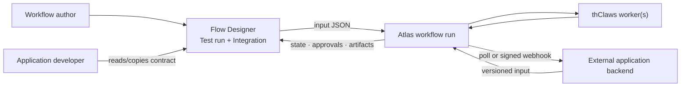

# Workflow Test and Application Interface Contract Plan

Status: **proposed; not implemented**

Planning date: 2026-07-31 (Asia/Bangkok)

Companion verification:
[WORKFLOW_TEST_INTEGRATION_CONTRACT_TEST_PLAN.md](WORKFLOW_TEST_INTEGRATION_CONTRACT_TEST_PLAN.md)

Baselines inspected:

- flow-designer `863dfd9` (`main`, clean)
- Atlas Control Plane `4b837cc` (`main`, clean)
- thClaws `3f64b4f` (read-only architectural review only)

The implementation session must re-check both repositories' current branch, HEAD, and worktree
before editing. These hashes record the planning evidence; they are not permission to reset,
checkout, or overwrite later work.

> **สรุปการตัดสินใจ:** การแก้ Flow Designer อย่างเดียวเพียงพอสำหรับการเพิ่มช่อง
> **Test run**, ส่ง JSON input จริง, ดู output และสร้างคู่มือ integration ที่อนุมานจาก flow
> ได้ทันที แต่ **ยังจำเป็นต้องปรับ Atlas** หากต้องการ contract ที่เป็นทางการ: persist ได้,
> version ได้, validate ทั้ง direct run และ trigger ก่อนสร้าง run, snapshot ไปกับ run และ
> ส่งต่อผ่าน pack import/export ได้ แผนนี้จึงแบ่งเป็นสาม milestone ที่ตรวจรับแยกกัน:
> Flow Designer MVP → Atlas authoritative contract → Flow Designer adoption.

## 1. Decision: when Atlas is and is not required

| Capability                                                              | Flow Designer only | Atlas change required |
| ----------------------------------------------------------------------- | ------------------ | --------------------- |
| Enter arbitrary JSON before starting a real run                         | Yes                | No                    |
| Pass that JSON through the existing `POST /api/workflow-runs` path      | Yes                | No                    |
| Infer `{input.*}` paths and possible artifact keys from the saved graph | Yes, advisory only | No                    |
| Show a copyable cURL/TypeScript/Python integration example              | Yes, advisory only | No                    |
| Persist a workflow-specific input schema and sample input               | No                 | **Yes**               |
| Reject invalid business input synchronously before a run is created     | No                 | **Yes**               |
| Apply the same contract to direct runs and trigger-fired runs           | No                 | **Yes**               |
| Pin an application call to an expected workflow version                 | No                 | **Yes**               |
| Interpret a historical run against the exact interface it started with  | No                 | **Yes**               |
| Preserve the interface through solution-pack import/export              | No                 | **Yes**               |
| Promise public output keys as an authoritative application contract     | No                 | **Yes**               |

The first milestone deliberately says **Observed integration contract**. It must not call inferred
prompt paths a JSON Schema, because prompt inspection cannot prove types, descriptions,
requiredness across branches, or final-output guarantees.

## 2. Current evidence

### 2.1 The input transport already exists

- The editor's current Run action supplies only `workflowDefinitionId`, so the run receives `{}`:
  [`src/routes/_app/workflows.$id.tsx`](../src/routes/_app/workflows.$id.tsx).
- `useStartRun` already accepts `input?: Record<string, unknown>`:
  [`src/lib/atlas-mutations.ts`](../src/lib/atlas-mutations.ts).
- The server-function boundary checks that `input` is a plain object:
  [`src/lib/atlas-mutations.functions.ts`](../src/lib/atlas-mutations.functions.ts).
- The fixed Atlas adapter already sends `params.input ?? {}` unchanged:
  [`src/lib/atlas-api.server.ts`](../src/lib/atlas-api.server.ts).

This means Milestone A is a UI/view-model/test change, not a new ingress service or generic proxy.

### 2.2 Output inspection mostly exists, but the test handoff is incomplete

- Run detail already renders runtime nodes, approvals, events, deliveries, and artifact
  preview/download:
  [`src/routes/_app/runs.$id.tsx`](../src/routes/_app/runs.$id.tsx).
- `toRunView` intentionally drops business input and carries only the reply callback URL. Adding
  unbounded input to that shared list/detail model would leak payloads into run-list responses:
  [`src/lib/atlas-mappers.ts`](../src/lib/atlas-mappers.ts).
- Live event invalidation refreshes run detail and run events, but not the run-artifact query:
  [`src/components/atlas/run-live.tsx`](../src/components/atlas/run-live.tsx).

Milestone A must add a bounded input preview to `RunDetailView` only and must make newly produced
artifacts appear without a manual page reload.

### 2.3 Atlas has no durable workflow interface today

- The canonical definition root permits only `name`, `description`, `graph`, `policy`, and
  `default_reply`, with `additionalProperties: false`:
  `/Users/seal/Documents/GitHub/atlas-control-plane/docs/specs/workflow-definition.schema.json`.
- `workflow_definitions` has no interface/schema/sample column:
  `/Users/seal/Documents/GitHub/atlas-control-plane/atlas/db.py`.
- Workflow create/update writers ignore unknown top-level fields rather than persisting them.
- Bundle-level `sample_input` is pack-authoring-only. It is ignored on import and exported as `{}`:
  `/Users/seal/Documents/GitHub/atlas-control-plane/docs/specs/pack-format.md`.
- Atlas validates only that run input is an object plus the reserved `_meta` envelope. A missing
  `{input.x}` normally fails later while a background node renders its prompt, after the start API
  has already returned `202`.

Do not hide interface data inside `graph`, `policy`, `description`, localStorage, or an undocumented
extension. Atlas is the workflow source of truth, so the authoritative contract requires an
additive Atlas field.

## 3. Terms and product boundaries

### Observed integration contract

Generated by Flow Designer from a saved graph on an Atlas version that has no `workflow.interface`.
It may describe:

- input paths referenced by prompts;
- which nodes reference each path;
- possible worker output artifact keys and their observed `text`/`json` kind;
- workflow id and currently observed version;
- exact existing API endpoints, lifecycle states, polling, webhook, and approval behavior.

It cannot promise types, business validation, branch-independent requiredness, or artifact
presence. It is useful for testing and application scaffolding, but remains advisory.

### Authoritative workflow interface

An optional, versioned `interface` object persisted and validated by Atlas. It describes the
business input contract, safe sample input, and public artifact keys. Atlas enforces it at the
shared workflow-start boundary and snapshots it onto each run.

### Non-goal: end-user application builder

Flow Designer will not become a no-code public portal builder in this track. It supplies a
deterministic test harness and an application contract. Teams remain free to build a web form,
mobile client, LINE/n8n adapter, internal service, or later a thClaws client against that contract.

## 4. Target flow



The browser continues to use the same-origin Flow Designer BFF. Generated examples for external
applications must put the Atlas bearer in backend/server code, never browser JavaScript,
localStorage, a URL, logs, or generated downloadable files.

## 5. Authoritative `interface` v1 decision

The Atlas workflow definition gains one optional root field:

```json
{
  "interface": {
    "schema_version": 1,
    "input_schema": {
      "type": "object",
      "additionalProperties": false,
      "required": ["applicant_name", "permit_type", "detail", "attachments"],
      "properties": {
        "applicant_name": {
          "type": "string",
          "title": "ชื่อผู้ขอ",
          "minLength": 1
        },
        "permit_type": {
          "type": "string",
          "title": "ประเภทคำขอ",
          "enum": ["ขออนุญาตก่อสร้าง", "ขออนุญาตดัดแปลงอาคาร"]
        },
        "detail": {
          "type": "object",
          "title": "รายละเอียด",
          "additionalProperties": false,
          "required": ["building_type", "floors"],
          "properties": {
            "building_type": {
              "type": "string"
            },
            "floors": {
              "type": "integer",
              "minimum": 1
            }
          }
        },
        "attachments": {
          "type": "array",
          "title": "รายการเอกสารแนบ",
          "items": {
            "type": "object",
            "additionalProperties": false,
            "required": ["name", "kind"],
            "properties": {
              "name": {
                "type": "string"
              },
              "kind": {
                "type": "string"
              }
            }
          }
        },
        "review_context": {
          "type": "string",
          "title": "บริบทเพิ่มเติม"
        }
      }
    },
    "sample_input": {
      "applicant_name": "นายทดสอบ ระบบ",
      "permit_type": "ขออนุญาตก่อสร้าง",
      "detail": {
        "building_type": "อาคารพาณิชย์",
        "floors": 2
      },
      "attachments": [
        {
          "name": "synthetic-id-copy.pdf",
          "kind": "identity-copy"
        },
        {
          "name": "synthetic-land-title.pdf",
          "kind": "land-record"
        }
      ],
      "review_context": "ข้อมูลสมมติสำหรับทดสอบ PoC เท่านั้น"
    },
    "outputs": [
      {
        "key": "intake_review",
        "kind": "text",
        "title": "ผลตรวจความครบถ้วน",
        "description": "รายการข้อมูลหรือเอกสารที่ยังขาด"
      },
      {
        "key": "assessment_result",
        "kind": "text",
        "title": "ผลการประเมิน",
        "description": "ผลประเมินคำขอหลังตรวจความครบถ้วน"
      }
    ],
    "primary_output": "assessment_result"
  }
}
```

This is the same canonical Permit Application contract used by
`PERMIT_APPLICATION_CONTRACT_V1` in the companion test plan. Do not substitute scalar
`detail`/`attachments` fields or rename its two possible outputs in implementation tests.

### 5.1 Root semantics

- `interface` is optional. Absence means a legacy workflow with no authoritative application
  contract.
- When present as an object, `schema_version` and `input_schema` are required. `sample_input`,
  `outputs`, and `primary_output` are optional; omitted `outputs` means no declared public outputs.
- On PUT, an absent field preserves the stored value; explicit `null` clears it; an object
  replaces it after validation.
- An interface edit participates in the existing `expected_version` optimistic save and increments
  workflow version exactly once.
- `schema_version` is the interface-format version. It is distinct from workflow version and pack
  schema version.
- Unknown interface fields are rejected. Silent typo acceptance would turn the specification into
  a false promise.

### 5.2 Bounded JSON-Schema-compatible profile

Atlas core is Python standard-library-only. V1 therefore implements and documents a bounded
profile rather than claiming complete JSON Schema Draft 2020-12 support.

Supported validation keywords:

- `type` using JSON primitive names (`object`, `array`, `string`, `number`, `integer`, `boolean`,
  `null`) as one string or a unique array of strings;
- `properties`, `required`, and boolean `additionalProperties`;
- `items`;
- `enum` and `const`;
- `minLength`, `maxLength`, `minimum`, `maximum`, `minItems`, and `maxItems`;
- annotation-only `title`, `description`, `default`, and `examples`;
- optional `$schema` only when it is exactly
  `https://atlas.local/schemas/workflow-interface-input-v1.schema.json`; it is an identifier and
  never causes a network fetch.

The root `input_schema` must declare object-only input: either `type: "object"` or the
single-entry equivalent `type: ["object"]`. Nested schemas may use the other supported types.
Schema annotations never supply runtime defaults: Atlas validates the caller's input exactly as
received after removing the two reserved top-level fields described below.

Rejected in v1:

- `$ref` or remote references;
- `oneOf`, `anyOf`, `allOf`, `not`, `if`/`then`/`else`;
- `pattern`, `patternProperties`, and arbitrary `format`;
- unevaluated/dependent/dynamic keywords;
- any unknown keyword.

Required defensive bounds (constants with focused tests and documented error messages):

- serialized `interface`: at most 64 KiB UTF-8;
- serialized `sample_input`: at most 64 KiB UTF-8;
- effective input for an interface-enabled run, including reserved fields after existing
  `default_reply` application: at most 1 MiB UTF-8;
- schema nesting: at most 16 levels;
- total declared properties: at most 256;
- each `required` list and `enum`: at most 256 entries;
- validation traversal: at most 10,000 instance nodes;
- `outputs`: at most 256 entries;
- every `title`: at most 256 Unicode code points;
- every `description`: at most 2,048 Unicode code points.

For all byte limits, serialize with Python
`json.dumps(value, ensure_ascii=True, sort_keys=True, separators=(",", ":"), allow_nan=False)` and
measure the UTF-8 bytes. Reject non-finite numbers. The 1 MiB effective-input check occurs before
reserved-field projection, so a large `_meta` or `_trigger_chain` cannot bypass it. It bounds
interface-enabled validation and persistence after JSON decoding; a general pre-decode HTTP body
cap for Atlas's shared `_read_json` remains a separate transport-hardening decision.

The validator must preserve JSON type distinctions: Python `bool` is not an integer/number for this
contract, and enum comparison must not treat `true` as equal to `1`.

### 5.3 Business projection and reserved Atlas fields

`input_schema` describes business fields. Before schema validation Atlas removes only the
documented reserved top-level fields from the validation projection:

- `_meta`
- `_trigger_chain`

It must not remove every underscore-prefixed key, because that would create a validation bypass.
The effective complete input remains persisted on the run. Atlas may perform its existing,
documented merge of workflow `default_reply` into `_meta.reply` when the caller omitted that reply;
schema projection must not otherwise mutate business fields. Existing `validate_run_input_envelope`
continues validating `_meta` independently.

### 5.4 Sample input

- `sample_input` is optional but, when present, must be an object and conform to `input_schema`.
- It is documentation/test data, never a default silently merged into production runs.
- Flow Designer must warn authors to use synthetic values. Never save credentials, tokens, model
  keys, real national IDs, or other real personal data as a sample.

### 5.5 Outputs

V1 declares the public artifact keys an application may consume:

- `key` must match `^[A-Za-z_][A-Za-z0-9_]{0,127}$` and must be produced by exactly one worker
  node;
- `kind` is `text` or `json` and must match that node's `output_format`;
- `title` and `description` are optional bounded annotations;
- `primary_output`, when present, must name one entry in `outputs`.

All v1 outputs are **possible**, not guaranteed on every successful branch. `primary_output` tells
clients which artifact to prefer when present; it does not create an execution dependency or
guarantee. Output-content schemas, required-on-success path proof, file-ref public outputs, and
webhook output projection are deferred. Atlas keeps returning all artifacts through existing
polling and webhook shapes for backward compatibility.

### 5.6 Prompt/schema consistency

After worker/manager interpolation parity is settled, Atlas cross-checks executable
`{input.path}` references when saving or validating an interface:

- every path in the graph must be representable by at least one value accepted by `input_schema`;
  a closed schema may not make a referenced path impossible to supply;
- every path used by the graph's start worker or start manager must be provably present after
  schema validation: each segment is declared through object `properties` and required at its
  level, and every intermediate segment declares object-only type (`type: "object"` or the
  single-entry equivalent `type: ["object"]`) rather than a nullable or mixed scalar/object union;
- paths used only by downstream or conditional nodes may remain optional because not every branch
  executes, but the interface documentation must not describe them as globally required.

This prevents an interface-valid direct start from failing immediately on its first prompt solely
because a required start input is missing. It still does not promise that every branch will have
all optional data, that workers will succeed, or that an output will be produced.

## 6. Milestone A — Flow Designer Test Run and observed contract

This milestone ships against the current Atlas API and requires no Atlas source change.

### A1. Test Run UX

Replace the current one-click `Run` action with `Test run`.

Clicking it opens a focused dialog/sheet with:

- **Input JSON** tab:
  - raw JSON textarea, always available;
  - an initial `{}` or generated skeleton based on `{input.*}` references;
  - parse feedback with line/column when available;
  - top-level object validation (`null`, array, string, number, boolean are invalid);
  - missing paths referenced by the start **worker** prompt as blocking errors;
  - paths referenced only by later/conditional nodes as warnings, not invented global
    requirements;
  - explicit notice that this starts a real Atlas run and may consume worker budget;
  - no automatic persistence of entered input in localStorage/sessionStorage.
- **Integration** tab:
  - advisory/observed badge;
  - workflow id and observed version;
  - detected input paths and referencing nodes;
  - possible artifact keys, producer nodes, and observed kind;
  - copyable direct-run request, polling, artifacts, approval, and signed-webhook examples;
  - safe cURL, backend TypeScript, and Python examples using placeholders for base URL/token;
  - downloadable advisory JSON/Markdown that contains no bearer or entered real test values.

If a graph has no detected input paths, the dialog may offer `{}` but must still require an
explicit click on `Start test run`; opening the dialog never causes a mutation.

### A2. Prompt-path inference

Add a pure module, for example `src/lib/workflow-run-contract.ts`, that:

- matches Atlas's identifier/dot-path grammar;
- deduplicates paths while retaining every referencing node;
- builds nested sample skeletons without treating array indices as supported;
- distinguishes the start node from later nodes;
- reports malformed/unsupported placeholder-like text without silently rewriting prompts;
- derives possible worker artifact outputs from `outputs[0]` and `output_format`;
- generates bounded, deterministic contract/snippet output suitable for unit snapshots.

The implementation must inspect and test Atlas's actual manager-prompt behavior before claiming
manager `{input.*}` substitution. Flow Designer's generated contract must match executable Atlas
behavior, not only an inspector hint. Any confirmed Atlas/docs discrepancy becomes an explicit
Milestone B compatibility fix, not a hidden assumption.

### A3. Start the real run

The route passes the parsed object through the existing mutation:

```ts
startRun.mutate({
  workflowDefinitionId: id,
  input,
});
```

Preserve all existing guards:

- saved graph only;
- dirty or locally invalid workflow cannot run;
- permission/RBAC remains Atlas-authoritative;
- mutation is single-flight;
- Atlas's real `wfr_…` id drives navigation;
- no optimistic/fake run state.

### A4. Run request/result inspection

- Add a bounded, pretty JSON `inputPreview` plus `inputTruncated` only to `RunDetailView`.
- Reuse the existing 32,000-character bounded-preview discipline.
- Keep input absent from `RunView` and every run list/query cache.
- Render the preview collapsed by default with a PII/sensitive-data warning.
- Refresh/invalidate this run's artifacts when live events indicate change and when the run
  transitions to a terminal state, so outputs appear without reload.
- Highlight contract-declared/observed output keys while preserving the complete artifact table.

### A5. Documentation

Update:

- `docs/guides/web-user-guide-en.md`
- `docs/guides/web-user-guide-th.md`
- `docs/BACKEND_INTEGRATION.md`
- `docs/TESTING_AND_QA.md`
- `docs/README.md`

Add focused application-integration guides in EN and TH if the existing operator guide becomes
too broad. Clearly distinguish browser UI, application backend, Atlas API, and thClaws worker.

### A6. Likely Flow Designer files

- `src/routes/_app/workflows.$id.tsx`
- `src/components/atlas/workflow-editor.tsx`
- new `src/components/atlas/workflow-test-run-dialog.tsx`
- new `src/lib/workflow-run-contract.ts`
- `src/lib/atlas-mappers.ts`
- `src/routes/_app/runs.$id.tsx`
- `src/components/atlas/run-live.tsx`
- `src/lib/query-keys.ts` only if a narrower artifact invalidation helper is needed
- new `tests/unit/workflow-run-contract.test.ts`
- `tests/unit/atlas-read-mappers.test.ts`
- `tests/contract/mutations.contract.test.ts`
- `tests/e2e/editor.spec.ts`
- `tests/e2e/runs.spec.ts` or the existing live worker suite

### A7. Acceptance

- Invalid JSON and every non-object JSON root cannot start a run.
- Nested business objects/lists/scalars arrive in Atlas unchanged. The only permitted metadata
  merge is Atlas's existing workflow `default_reply` into `_meta.reply` when the caller omitted it.
- Missing paths in the start worker prompt are caught before mutation; conditional paths are
  truthfully warnings.
- Test run returns a real Atlas id and navigates to `/runs/wfr_…`.
- Run detail shows a bounded persisted-input preview; Flow Designer's browser-facing run-list
  responses/models still omit input.
- Artifacts produced after the run page first loads appear without manual reload.
- Generated examples contain no actual bearer, private origin, callback secret, or entered test
  payload.
- A Permit-style workflow can be tested end to end with `applicant_name`, `permit_type`, `detail`,
  and `attachments`.
- Existing dirty-state, validation, permission, approval, cancellation, artifact preview/download,
  and delivery tests remain green.

## 7. Milestone B — Atlas authoritative workflow interface

Milestone B is a separate Atlas repository change. It must land and pass Atlas's own gate before
Flow Designer adopts it.

### B0. Architecture record and parity prerequisite

- Add an Atlas ADR recording the optional `workflow.interface` decision, bounded schema profile,
  reserved-field projection, output semantics, version/snapshot behavior, and legacy fallback.
- Cross-reference the existing Input Adapter Contract rather than creating a third ingress
  envelope.
- Verify worker and manager prompt interpolation against the published EN/TH concepts and visual
  builder specs. If the manager path does not render documented `{input.*}` placeholders, align the
  implementation with the published contract and add a hermetic regression check before interface
  inference becomes authoritative.

### B1. Persistence and CRUD

Append a new idempotent migration; never edit a shipped migration:

- `workflow_definitions.interface TEXT NULL`
- `workflow_runs.interface_snapshot TEXT NULL`
- `workflow_runs.workflow_version_snapshot INTEGER NULL`

Update:

- row JSON decoding;
- definition create/read/list/update;
- explicit null clear semantics;
- optimistic version save;
- run create/read/list;
- audit details only as needed, without storing the full interface in audit logs.

Unknown fields inside the new `interface`, `input_schema`, and output entries must not be silently
discarded. This milestone does not introduce a broader breaking rejection policy for legacy
top-level workflow extras. POST/PUT validation rejects malformed interfaces before DB writes.

### B2. Shared validator

Implement one standard-library validator module used by:

- workflow POST/PUT;
- existing `POST /api/workflows/{id}/validate`;
- sample-input validation;
- direct workflow start;
- trigger-fired workflow start;
- pack import;
- any future validate-input endpoint.

At workflow save:

- validate the interface shape and defensive bounds;
- validate `sample_input`;
- cross-check outputs and primary output against the graph;
- reject ambiguous declared keys produced by multiple nodes;
- cross-check executable prompt input paths using Section 5.6;
- when a graph changes while the request omits `interface`, revalidate the stored interface against
  the merged candidate graph before writing; the existing validate endpoint follows the same merge
  rule without writing.

At run start:

1. apply the existing workflow `default_reply` rule;
2. validate the existing `_meta` envelope;
3. compare the optional expected workflow version against the loaded definition;
4. apply the 1 MiB effective-input bound when that definition has an interface;
5. derive the business projection;
6. validate the projection against that same definition's stored input schema;
7. only then create/audit/start the workflow run.

For a direct start, invalid interface input returns synchronous `400` and creates no run, runtime
node, workflow event, job, approval, artifact, delivery, or workflow-run create/provenance audit.
A version mismatch returns `409` and creates no run. Trigger `/fire` is deliberately different
when an object payload fails interface/envelope validation: it preserves the existing HTTP `202`
response, records a failed trigger event with `run: null`, and creates no workflow run or runtime
work. A non-object trigger `payload` retains the separate existing HTTP `400` before trigger
bookkeeping. Existing trigger dedupe claims and received/failed event bookkeeping remain in their
current order; the no-side-effect guarantee applies to workflow-run creation and runtime work, not
trigger bookkeeping.

### B3. Additive API contract

Add optional `expected_workflow_version` to direct start:

```json
{
  "workflow_definition_id": "wfd_...",
  "expected_workflow_version": 7,
  "input": {}
}
```

The comparison uses the same definition row that supplies graph/policy/interface, avoiding a
second-read time-of-check/time-of-use race.

Do not change existing endpoint paths or response envelopes. Existing requests that omit the new
field and workflows with no interface behave exactly as before.

Trigger `/fire` continues to pass an object `payload` as run input through the same shared
validator. V1 need not add a trigger version pin, but the API reference and generated contract
must state that limitation. Fixed-payload schedule/internal triggers that cannot satisfy a
workflow interface must record a clear failed trigger event, create no run, and retain current
schedule advancement; Flow Designer should warn about known incompatibility when authoring.

### B4. Run snapshots

Snapshot:

- workflow version;
- interface object or null;
- existing graph and policy.

Resume/recovery and historical inspection use the snapshots. Editing or deleting a workflow cannot
reinterpret an existing run against a later application contract.

### B5. Packs

- Add optional `interface` inside each `workflows[]` entry.
- Validate and persist it on import.
- Preserve it on export.
- Keep accepting legacy bundle-level `sample_input` for compatibility, but continue documenting it
  as deprecated authoring metadata; do not ambiguously apply one sample to multiple workflows.
- Update the bundled example pack to demonstrate per-workflow interface without placing real PII
  in the sample.
- Include interface bytes in the existing pack signature naturally; do not invent a second
  signature scheme.

### B6. API, schema, bilingual docs, and threat model

Required Atlas updates:

- `docs/specs/workflow-definition.schema.json`
- `docs/specs/openapi.yaml`
- `docs/specs/api-reference-en.md`
- `docs/specs/api-reference-th.md`
- `docs/specs/workflow-visual-builder-spec-en.md`
- `docs/specs/workflow-visual-builder-spec-th.md`
- `docs/concepts-en.md`
- `docs/concepts-th.md`
- `docs/specs/input-adapter-contract.md`
- `docs/specs/pack-format.md`
- `docs/specs/threat-model.md`
- Atlas docs index, progress/release evidence, and new ADR

The docs must say explicitly:

- this is a bounded profile, not full JSON Schema;
- schema validation excludes only `_meta` and `_trigger_chain`;
- samples must be synthetic;
- outputs are possible/public keys, not guaranteed on all branches;
- actual binary file intake is not solved by a JSON `attachments` field;
- `/workflow-runs/{id}/files` requires an existing run and does not atomically stage files for the
  start node;
- the 1 MiB interface-enabled effective-input bound runs after JSON decoding and does not claim to
  be a general transport-level request-body cap.

### B7. Atlas hermetic test and gate

Add `scripts/check_workflow_interface.py` (or an equivalently focused name), fold it into
`scripts/gate.sh`, and cover:

- migration from the previous schema version and idempotent re-run;
- absent/object/null interface CRUD and version increment;
- unknown field and every unsupported schema keyword rejection;
- exact profile URI, size serialization, all supported primitive/container validations, and every
  defensive bound;
- bool-vs-number and typed enum behavior;
- sample conformance;
- output key/kind/primary cross-check;
- impossible prompt path and optional downstream path handling;
- start-node prompt paths must be schema-required at every segment;
- nullable or mixed-type intermediate start-path segments are rejected; object-only
  intermediates may use either `type: "object"` or `type: ["object"]`;
- direct valid start;
- direct invalid input returns 400 with no persisted run;
- 1 MiB effective-input boundary, a `default_reply` merge that crosses it, and oversized
  direct/trigger behavior;
- expected-version match and 409 mismatch with no persisted run;
- manual/webhook trigger valid and invalid payload;
- non-object `/fire` payload retains 400 and creates no trigger event;
- fixed trigger incompatibility records failure and starts no run;
- version/interface snapshots survive later definition edit/delete;
- pack import/export/signature round trip;
- omitted possible/primary output does not fail a run, and polling/signed webhooks still expose
  undeclared artifacts;
- workflow read/update RBAC remains unchanged and audits do not copy the full interface/sample;
- legacy workflow/run/pack behavior unchanged;
- documented worker/manager placeholder parity.

Mutation-test the check: disabling input validation, dropping interface persistence, omitting the
snapshot, accepting an unsupported keyword, or ignoring the version guard must make the focused
check fail.

## 8. Milestone C — Flow Designer adopts authoritative Atlas interface

Begin only after Milestone B is merged or available at a clean, recorded Atlas commit with
`./scripts/gate.sh` green.

### C1. Contract adoption

- Add guarded types/mappers for optional nullable `workflow.interface` and run snapshots.
- Include interface in create/update/editable view, dirty baseline, optimistic save, and conflict
  preservation.
- Never silently drop a stored interface. Unknown interface schema versions make the contract
  read-only with a clear compatibility message.
- Start authoritative test runs with `expected_workflow_version`.
- Keep advisory inference as a legacy fallback when `interface` is absent.
- Requalify the legacy observed extractor against the pinned Atlas commit: after manager
  interpolation parity lands, executable manager `{input.*}` paths participate in observed
  extraction, with start-manager missing paths blocking and downstream-manager paths warning.

### C2. Interface authoring

Add a workflow-level **Application interface** inspector:

- input-schema JSON editor using the documented Atlas profile;
- synthetic sample-input JSON editor;
- graph-derived output-key selector/table;
- public output annotations and primary-output selector;
- local diagnostics mirroring Atlas's exact profile URI, structural rules, non-byte count bounds,
  prompt/schema consistency, and output rules, while Atlas remains authoritative; byte-size
  estimates are advisory because JavaScript and Python number serialization are not
  byte-identical;
- no separate UI-layout schema language in v1.

Always retain a raw JSON mode. A basic generated form may cover top-level scalar, enum, and boolean
fields, but nested objects/arrays must remain testable through raw JSON without lossy conversion.

### C3. Authoritative Test/Integration UX

- Prefill Test Run from authoritative `sample_input`.
- Validate locally for fast feedback, then accept Atlas's 400/409 as final.
- Show an advisory client-side size warning near the 1 MiB bound, but do not block solely on the
  JavaScript estimate; Atlas measures the effective input after `default_reply` and remains final.
- Change the Integration badge from Observed to Authoritative.
- Generate exact input schema, sample, outputs, workflow version, and
  `expected_workflow_version` request.
- Display snapshot/version on run detail so historical results are interpreted correctly.
- Warn on fixed trigger payload incompatibility using Atlas facts; do not invent payload mapping.

### C4. Requalification

Pin the Atlas commit in integration documentation and extend:

- unit guards and editor serialization tests;
- real-Atlas contract tests for interface CRUD, validation, trigger, snapshot, version guard, and
  pack behavior;
- browser tests for authoring, sample-driven Test Run, 400/409 display, authoritative generated
  guide, legacy fallback, start-manager observed preflight, server-side size rejection including a
  `default_reply` boundary crossing, and PII-safe input preview;
- production build, bundle scan, and remote-like BFF/token-isolation tests.

## 9. Test matrix

| Layer          | Milestone A                                                                                                               | Milestones B/C                                                                         |
| -------------- | ------------------------------------------------------------------------------------------------------------------------- | -------------------------------------------------------------------------------------- |
| Pure unit      | placeholder extraction, skeleton, warnings/errors, snippet generation, bounded input preview                              | bounded schema validator, interface parser/serializer, generated form, snapshot guards |
| Flow contract  | business input persists except documented default-reply metadata merge; real run id; no input in browser-facing run lists | authoritative CRUD/400/409/trigger/snapshot/pack against real Atlas                    |
| Atlas hermetic | none                                                                                                                      | one mutation-tested workflow-interface check in `scripts/gate.sh`                      |
| Browser        | Test Run dialog, no mutation on open, output appears without reload, copy/download contains no secret                     | interface authoring, sample prefill, authoritative badge, legacy fallback              |
| Security       | no bearer or actual input in storage/downloads; bounded detail preview                                                    | bounds, reserved-field projection, synthetic sample warning, threat model              |
| Compatibility  | current Atlas unchanged                                                                                                   | legacy workflow/run/trigger/pack calls unchanged when interface/version pin omitted    |

## 10. Repository and commit discipline

- Read each repository's `AGENTS.md` before acting.
- Inspect git status before every milestone. Preserve all user changes and stop if an overlapping
  dirty file cannot be worked around.
- Keep Atlas and Flow Designer work on separate branches/commits/PRs.
- A milestone prompt stops before commit. After its diff, automated evidence, and manual UAT are
  accepted, the user separately authorizes a new commit and records its hash. The next milestone
  must start from that clean recorded commit; an uncommitted implementation from the previous
  milestone is a blocker. Only the explicitly recorded planning-document baseline may remain
  uncommitted and read-only.
- flow-designer is connected to Lovable: never amend, rebase, squash, force-push, or otherwise
  rewrite published history.
- Do not push, open PRs, or merge unless explicitly requested.
- Do not modify thClaws in this track.
- Never modify generated/vendor/build artifacts to make checks pass.

Recommended logical commit boundaries:

1. Flow: pure observed-contract module + unit tests.
2. Flow: Test Run UI and real input mutation.
3. Flow: bounded run input/output refresh + browser/contract tests.
4. Flow: integration guides and evidence.
5. Atlas: ADR/schema profile + validator tests.
6. Atlas: migration/CRUD/run validation/snapshots/version guard.
7. Atlas: packs/OpenAPI/EN-TH docs/hermetic gate.
8. Flow: authoritative contract adoption and requalification.

## 11. Risks and controls

| Risk                                            | Control                                                                                                                  |
| ----------------------------------------------- | ------------------------------------------------------------------------------------------------------------------------ |
| Advisory contract presented as truth            | Explicit Observed badge; no invented types/requiredness; authoritative badge only with stored Atlas interface            |
| PII or secrets copied into samples/test history | Synthetic-sample warning; no test-input local persistence; bounded collapsed run-detail preview only; never in run lists |
| Branch output treated as guaranteed             | V1 output docs say possible; no required-on-success promise                                                              |
| Schema implementation claims full standard      | Closed documented profile; reject unsupported/unknown keywords                                                           |
| Validation bypass through reserved keys         | Remove exactly `_meta` and `_trigger_chain`, then validate the remaining business projection                             |
| Oversized interface-enabled run input           | Exact 1 MiB effective-input byte cap before projection; direct 400 versus trigger failed-event semantics                 |
| JSON/Python type confusion                      | Explicit bool-vs-number and typed-enum tests                                                                             |
| Schema-valid request fails at start prompt      | Save-time prompt/schema cross-check; every start-node input path must be schema-required                                 |
| Run starts on a newer incompatible workflow     | Optional expected workflow version and 409 before run creation                                                           |
| Historical run reinterpreted after edits        | Interface and workflow-version snapshots                                                                                 |
| Trigger repeatedly starts invalid work          | Shared validation, clear failed trigger event, no run, authoring warning for fixed payloads                              |
| Output appears empty during a live test         | Explicit artifact invalidation on change/terminal transition                                                             |
| Binary `attachments` falsely implied            | Docs and UI distinguish JSON metadata/text from staged binary files                                                      |
| Cross-repository work becomes one unsafe change | Three milestones, separate gates and review checkpoints                                                                  |

## 12. Deferred work

- Full JSON Schema implementation or remote `$ref`.
- Visual end-user form/page builder.
- Pre-start atomic binary file staging and worker mounting.
- Required-on-success output/path proof.
- JSON artifact content-schema validation.
- Filtering existing webhook callbacks down to public outputs only.
- Trigger-level expected workflow version.
- Public anonymous ingress or browser-held Atlas tokens.
- Importing/copying thClaws GUI components into Flow Designer.
- A general pre-decode request-body cap for Atlas's shared `_read_json` transport.

## 13. Later thClaws use

thClaws should remain a worker/runtime and optional client, not a dependency of Flow Designer's
test harness. Its current GUI run bridge is prompt/session-centric rather than a typed concurrent
Atlas-run contract.

A later, separate track may expose Atlas through MCP tools such as:

- `get_workflow_contract`
- `start_workflow_run`
- `get_workflow_run`
- `list_run_events`
- `list_run_artifacts`
- bounded approve/cancel tools under Atlas RBAC

thClaws Chat or an MCP-App widget could then render the same schema-driven input and artifacts as a
reference application. Credentials remain in the Atlas MCP server/OAuth boundary, not GUI shell
storage. This work begins only after the Atlas interface is authoritative.

## 14. Completion gates

### Flow Designer

Run from a clean/reviewed worktree:

```bash
bun run typecheck
bun run lint
bun run format:check
bun run test
bun run test:contract
bun run test:stream
bun run test:e2e
bun run test:remote
bun run build
bun run scan:bundle
git diff --check
```

Use Node 24 and the repository-pinned Bun. If a command cannot run, report the exact blocker and
run the closest safe subset; do not call the milestone complete.

### Atlas

```bash
./scripts/gate.sh
./scripts/lint.sh
git diff --check
```

Atlas completion also requires the focused workflow-interface check to be mutation-tested and
folded into the gate, OpenAPI plus EN/TH parity, and an updated threat model.

### Final outcome

The track is complete only when:

1. a workflow can be tested with explicit JSON from Flow Designer;
2. request and artifacts are inspectable without leaking input into list views;
3. an external developer can copy a working versioned integration example;
4. Atlas persists and enforces the optional interface on both ingress paths;
5. bad input/version creates no run;
6. runs snapshot their workflow version and interface;
7. legacy workflows and clients continue working unchanged;
8. both repositories' full gates are green against a recorded pair of commits.
