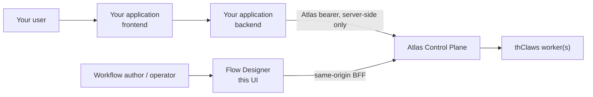

# Calling a workflow from your own application

This guide is for developers building an application **on top of** an Atlas
workflow — a web form, a mobile client, a LINE or n8n adapter, an internal
service. It is not the operator guide; for running and watching workflows in
this UI see the [Web User Guide](web-user-guide-en.md).

## Who does what



| Piece                    | Owns                                                                                   |
| ------------------------ | -------------------------------------------------------------------------------------- |
| **Flow Designer** (this) | Authoring, testing, and watching workflows. An operator tool, not a runtime dependency |
| **Your backend**         | Holding the Atlas bearer, calling Atlas, mapping results into your own product         |
| **Atlas**                | Authentication, authorization, persistence, execution, artifacts, triggers, deliveries |
| **thClaws**              | The worker that actually runs a node. You never call it; Atlas routes to it            |

Your application talks to **Atlas**, not to Flow Designer. Flow Designer holds
its Atlas bearer in an httpOnly cookie behind its own server, and that path is
for its own browser sessions only — it is not an API for other products.

> **Never put an Atlas bearer in browser JavaScript**, a URL, `localStorage`,
> or a mobile app binary. Anything running on the page can read it, and an
> Atlas token carries the full permissions of the user it belongs to. Call
> Atlas from a backend you control.

## Get a token

An admin mints one in **Users & Tokens → Mint token**. The raw value is shown
exactly once — Atlas stores only a hash. Give it to your backend through your
normal secret mechanism (environment variable, secret manager), and give it the
least-privileged Atlas role that can start the runs you need.

## The five calls

Everything below is stable Atlas API. `$ATLAS_BASE_URL` and `$ATLAS_TOKEN` are
placeholders for your own values.

### 1. Start a run

```bash
curl -sS -X POST "$ATLAS_BASE_URL/api/workflow-runs" \
  -H "Authorization: Bearer $ATLAS_TOKEN" \
  -H "Content-Type: application/json" \
  -d '{"workflow_definition_id":"wfd_...","input":{"topic":"weather"}}'
```

Atlas answers `202` with the run **wrapped in an envelope**:

```json
{ "run": { "id": "wfr_...", "state": "queued" } }
```

Every response below is wrapped the same way. Read `body.run.id`, never `body.id` — this is the
single most common integration mistake against Atlas, and it fails silently: a polling loop
reading `body.state` sees `undefined` forever.

`input` must be a JSON **object**. Nested objects, arrays, strings, numbers,
booleans, and `null` all persist exactly as sent. The one thing Atlas adds is
inside the reserved `_meta` envelope: when the workflow has a `default_reply`
and the caller did not supply `_meta.reply`, Atlas merges it in. No business
field is added, removed, or rewritten.

If the workflow has a **declared** interface (see below), the request also
takes an optional `expected_workflow_version`:

```json
{
  "workflow_definition_id": "wfd_...",
  "input": { "applicant_name": "...", "detail": { "floors": 2 } },
  "expected_workflow_version": 7
}
```

Atlas compares it against the same definition row it loads to start the run
— no separate read, so there is no window for a concurrent edit to slip past
the check. A mismatch answers **409** and creates no run; a business input
that fails the declared `input_schema` answers **400** naming the field or
path, also with no run created. Neither is retried automatically — decide,
then resubmit deliberately, after re-reading the definition if the version
moved. `expected_workflow_version` is entirely optional and has no effect on
a workflow with no declared interface, which behaves exactly as it always
has.

> **This route has no dedupe key.** Two POSTs are two runs. If your caller can
> retry, key the work on your side, or use a trigger's
> `POST /api/workflow-triggers/{id}/fire`, which does accept one — but note
> the trigger route does **not** accept `expected_workflow_version` (see
> "Trigger limitation" below).

### 2. Poll the run

```bash
curl -sS "$ATLAS_BASE_URL/api/workflow-runs/$RUN_ID" \
  -H "Authorization: Bearer $ATLAS_TOKEN"
```

The detail body is `{ "run": …, "nodes": …, "edges": …, "approvals": … }`, so the
state is at `body.run.state`. The open gates of a `waiting_for_human` run are in
`body.approvals`.

There is no run-level event stream; polling is the supported way to follow a
run. (Atlas does stream per _job_ events, which is what this UI's live log
consumes, but that is a different granularity.)

Check the HTTP status before reading the body: a 4xx answers `{"error": "..."}`
with no `run` key at all.

| Waiting                                                                 | Terminal                           |
| ----------------------------------------------------------------------- | ---------------------------------- |
| `queued`, `running`, `paused`, `waiting_for_human`, `recovery_required` | `succeeded`, `failed`, `cancelled` |

`waiting_for_human` is **not** terminal — a human gate is open and your poll
loop must not treat it as done.

### 3. Read the outputs

```bash
curl -sS "$ATLAS_BASE_URL/api/workflow-runs/$RUN_ID/artifacts" \
  -H "Authorization: Bearer $ATLAS_TOKEN"
```

The body is `{ "artifacts": [ … ] }`.

### 4. Decide an approval

```bash
curl -sS -X POST "$ATLAS_BASE_URL/api/approvals/$APPROVAL_ID/approve" \
  -H "Authorization: Bearer $ATLAS_TOKEN"
```

`/reject` and `/choose` are the other two. A gate that declares choices takes
`/choose`; one that does not takes `/approve`.

### 5. Optional: be called back

Instead of polling, set a reply webhook in the run's reserved envelope:

```json
{
  "workflow_definition_id": "wfd_...",
  "input": {
    "topic": "weather",
    "_meta": { "reply": { "mode": "webhook", "callback_url": "https://your.app/hook" } }
  }
}
```

Atlas signs the callback with `X-Atlas-Signature: sha256=<hex>`, an HMAC-SHA256 of
the **raw** request body keyed on Atlas's `ATLAS_SECRET_KEY`. Verify over the bytes
as received — parsing and re-serialising the JSON changes key order and whitespace,
and the digest will never match — and compare in constant time. The Integration
tab generates a working Express verifier.

Your endpoint must be on Atlas's outbound allowlist and must not embed credentials
in the URL. A workflow can also carry a `default_reply` so callers need not repeat
the reply block on every run.

## Two contract modes: declared and observed

Flow Designer's **Test run → Integration** tab generates a per-workflow
document — copyable cURL/TypeScript/Python, plus JSON and Markdown downloads
— in one of two modes, and its label names which one is active. Which mode a
workflow gets is entirely Atlas's own state, not a client choice.

### Declared · enforced by Atlas

A workflow can carry an optional, **authoritative** `interface`: a stored
`input_schema`, an optional synthetic `sample_input`, and the public output
keys ("possible", not guaranteed) an external caller can rely on. When one is
present (`schema_version: 1`), Atlas itself validates every direct start
against it — this is not client-side inference. The minimum compatible Atlas
checkout for this feature is commit `15c4876aa4f86e109a3cc52d6a299f46791053a2`;
an older Atlas has no `interface` field at all, and a workflow on it is
always in Observed mode instead.

```json
{
  "schema_version": 1,
  "input_schema": {
    "type": "object",
    "additionalProperties": false,
    "required": ["applicant_name", "detail"],
    "properties": {
      "applicant_name": { "type": "string", "minLength": 1 },
      "detail": {
        "type": "object",
        "additionalProperties": false,
        "required": ["floors"],
        "properties": { "floors": { "type": "integer", "minimum": 1 } }
      }
    }
  },
  "sample_input": { "applicant_name": "Test Applicant", "detail": { "floors": 2 } },
  "outputs": [{ "key": "assessment_result", "kind": "text" }],
  "primary_output": "assessment_result"
}
```

`input_schema` is a **bounded** profile, not full JSON Schema — no `$ref`, no
`oneOf`/`anyOf`/`allOf`/`not`, no `pattern` or `format`. `sample_input` is
documentation and test data; Atlas never merges it into a real run. Every
output is **possible**, never guaranteed — a graph can branch, so an omitted
output does not fail an otherwise successful run, and every artifact
(declared or not) still flows through the existing polling and webhook
shapes unchanged — nothing about approvals, artifact retrieval, or the reply
webhook changes when a workflow has a declared interface.

Build your request straight from the stored contract:

```json
{
  "workflow_definition_id": "wfd_...",
  "input": { "applicant_name": "...", "detail": { "floors": 2 } },
  "expected_workflow_version": 7
}
```

A business input that fails `input_schema` answers **400** with the failing
field/path named; a stale `expected_workflow_version` answers **409**. Both
create no run, and neither should be retried automatically.

### Observed · not enforced by Atlas

The fallback for a workflow with no usable interface (absent, or in a
`schema_version` this Flow Designer build does not recognise). Atlas stores
no input schema in this case — it validates only that `input` is an object
and that `_meta` is well-formed. The Integration tab instead derives what it
can by reading the saved graph's prompt text, and the result is **advisory**:

| It can tell you                                      | It cannot tell you                                    |
| ---------------------------------------------------- | ----------------------------------------------------- |
| Which `{input.x}` paths the graph references         | What type any of them should be                       |
| Which nodes read each path                           | Which are required — that depends on the branch taken |
| Which path the **start** node needs before branching | Whether a downstream node will run at all             |
| Which artifact keys a worker **may** write           | Whether any artifact will exist                       |
| The observed `text`/`json` kind of each key          | The shape of a `json` artifact's content              |

Treat it as a starting point you verify against real runs, not as a schema.
Two consequences worth planning for:

- **No version pin.** `POST /api/workflow-runs` accepts
  `expected_workflow_version` only in Declared mode; an Observed workflow has
  no way to detect an edit between reading the contract and calling the API.
  Coordinate workflow changes with the teams that call them, or ask the
  workflow's author to add a declared interface.
- **A missing input fails late.** Atlas creates the run and returns `202`, then
  the node fails while rendering its prompt. Check the run state; a `202` is
  not a success.

Flow Designer never promotes an observed field into a declared interface
automatically, and never mutates a declared interface to match what it
observes in the graph — if the two disagree, the editor's Application
interface panel shows a drift warning naming the exact path, node, or
output, and Atlas's own declared validation remains the boundary either way.

### Manager (AI Decision) nodes

Since Atlas's manager-prompt-parity fix (in effect at and after commit
`15c4876aa4f86e109a3cc52d6a299f46791053a2`), a manager node's prompt is
substituted exactly like a worker's — `{input.x}` is a real, executable
reference, fail-closed on an unresolved path the same way. In **Observed**
mode Flow Designer therefore lists a manager's `{input.x}` reference as an
ordinary observed input path: blocking if the manager is the graph's start
node, a warning otherwise. In **Declared** mode nothing manager-specific
applies at all — `input_schema` governs every path regardless of which node
type renders it. On an Atlas checkout **older** than this fix, the same
placeholder reached the model literally and supplying a value changed
nothing; see [ATLAS_LIMITATIONS.md](../ATLAS_LIMITATIONS.md) for that
historical behaviour.

### Trigger limitation

`POST /api/workflow-triggers/{id}/fire` does not accept
`expected_workflow_version` in this Atlas version, in either contract mode.
A fixed-payload trigger (a schedule, or an internal event) that cannot
satisfy a declared interface records a **failed** trigger event and starts
no run — but it still advances `next_fire_at`/`last_fired_at` normally,
rather than wedging the schedule slot. An **object** payload that fails
validation still answers **202** with `run: null` and the event's `error`
naming why; a **non-object** payload answers 400 before any trigger
bookkeeping runs at all.

### Files are not JSON

An `attachments` field in `input` is text or metadata — a list of document
names, a URL — never an uploaded file. Atlas's
`POST /api/workflow-runs/{id}/files` needs a run that **already exists**, so
there is no way to stage binary input for the start node. If your workflow
needs a real file up front, put it somewhere the worker can reach and pass a
reference.

## What is not generated for you

Generated examples never contain your Atlas origin, a bearer, a session
cookie, a callback secret, or anything typed into the Test run dialog. They use
placeholders throughout. Fill them in from your own configuration — and keep
them out of anything you commit.
