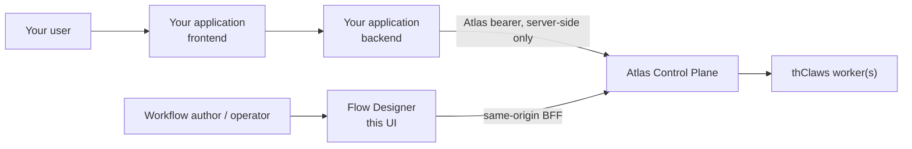

# Calling a workflow from your own application

This guide is for developers building an application **on top of** an Atlas
workflow — a web form, a mobile client, a LINE or n8n adapter, an internal
service. It is not the operator guide; for running and watching workflows in
this UI see the [Web User Guide](web-user-guide-en.md).

## Who does what



| Piece                    | Owns                                                                                   |
| ------------------------ | -------------------------------------------------------------------------------------- |
| **Flow Designer** (this) | Authoring, testing, and watching workflows. An operator tool, not a runtime dependency |
| **Your backend**         | Holding the Atlas bearer, calling Atlas, mapping results into your own product         |
| **Atlas**                | Authentication, authorization, persistence, execution, artifacts, triggers, deliveries |
| **thClaws**              | The worker that actually runs a node. You never call it; Atlas routes to it            |

Your application talks to **Atlas**, not to Flow Designer. Flow Designer holds
its Atlas bearer in an httpOnly cookie behind its own server, and that path is
for its own browser sessions only — it is not an API for other products.

> **Never put an Atlas bearer in browser JavaScript**, a URL, `localStorage`,
> or a mobile app binary. Anything running on the page can read it, and an
> Atlas token carries the full permissions of the user it belongs to. Call
> Atlas from a backend you control.

## Get a token

An admin mints one in **Users & Tokens → Mint token**. The raw value is shown
exactly once — Atlas stores only a hash. Give it to your backend through your
normal secret mechanism (environment variable, secret manager), and give it the
least-privileged Atlas role that can start the runs you need.

## The five calls

Everything below is stable Atlas API. `$ATLAS_BASE_URL` and `$ATLAS_TOKEN` are
placeholders for your own values.

### 1. Start a run

```bash
curl -sS -X POST "$ATLAS_BASE_URL/api/workflow-runs" \
  -H "Authorization: Bearer $ATLAS_TOKEN" \
  -H "Content-Type: application/json" \
  -d '{"workflow_definition_id":"wfd_...","input":{"topic":"weather"}}'
```

Atlas answers `202` with the run **wrapped in an envelope**:

```json
{ "run": { "id": "wfr_...", "state": "queued" } }
```

Every response below is wrapped the same way. Read `body.run.id`, never `body.id` — this is the
single most common integration mistake against Atlas, and it fails silently: a polling loop
reading `body.state` sees `undefined` forever.

`input` must be a JSON **object**. Nested objects, arrays, strings, numbers,
booleans, and `null` all persist exactly as sent. The one thing Atlas adds is
inside the reserved `_meta` envelope: when the workflow has a `default_reply`
and the caller did not supply `_meta.reply`, Atlas merges it in. No business
field is added, removed, or rewritten.

> **This route has no dedupe key.** Two POSTs are two runs. If your caller can
> retry, key the work on your side, or use a trigger's
> `POST /api/workflow-triggers/{id}/fire`, which does accept one.

### 2. Poll the run

```bash
curl -sS "$ATLAS_BASE_URL/api/workflow-runs/$RUN_ID" \
  -H "Authorization: Bearer $ATLAS_TOKEN"
```

The detail body is `{ "run": …, "nodes": …, "edges": …, "approvals": … }`, so the
state is at `body.run.state`. The open gates of a `waiting_for_human` run are in
`body.approvals`.

There is no run-level event stream; polling is the supported way to follow a
run. (Atlas does stream per _job_ events, which is what this UI's live log
consumes, but that is a different granularity.)

Check the HTTP status before reading the body: a 4xx answers `{"error": "..."}`
with no `run` key at all.

| Waiting                                                                 | Terminal                           |
| ----------------------------------------------------------------------- | ---------------------------------- |
| `queued`, `running`, `paused`, `waiting_for_human`, `recovery_required` | `succeeded`, `failed`, `cancelled` |

`waiting_for_human` is **not** terminal — a human gate is open and your poll
loop must not treat it as done.

### 3. Read the outputs

```bash
curl -sS "$ATLAS_BASE_URL/api/workflow-runs/$RUN_ID/artifacts" \
  -H "Authorization: Bearer $ATLAS_TOKEN"
```

The body is `{ "artifacts": [ … ] }`.

### 4. Decide an approval

```bash
curl -sS -X POST "$ATLAS_BASE_URL/api/approvals/$APPROVAL_ID/approve" \
  -H "Authorization: Bearer $ATLAS_TOKEN"
```

`/reject` and `/choose` are the other two. A gate that declares choices takes
`/choose`; one that does not takes `/approve`.

### 5. Optional: be called back

Instead of polling, set a reply webhook in the run's reserved envelope:

```json
{
  "workflow_definition_id": "wfd_...",
  "input": {
    "topic": "weather",
    "_meta": { "reply": { "mode": "webhook", "callback_url": "https://your.app/hook" } }
  }
}
```

Atlas signs the callback with `X-Atlas-Signature: sha256=<hex>`, an HMAC-SHA256 of
the **raw** request body keyed on Atlas's `ATLAS_SECRET_KEY`. Verify over the bytes
as received — parsing and re-serialising the JSON changes key order and whitespace,
and the digest will never match — and compare in constant time. The Integration
tab generates a working Express verifier.

Your endpoint must be on Atlas's outbound allowlist and must not embed credentials
in the URL. A workflow can also carry a `default_reply` so callers need not repeat
the reply block on every run.

## The observed contract

Flow Designer's **Test run → Integration** tab generates a per-workflow
document — copyable cURL/TypeScript/Python, plus JSON and Markdown downloads.
It is labelled **Observed · not enforced by Atlas**, and that label is exact.

Atlas stores **no input schema** for a workflow today. It validates that
`input` is an object and that `_meta` is well-formed; nothing else. So the
Integration tab derives what it can by reading the saved graph's prompt text,
and the result is **advisory**:

| It can tell you                                      | It cannot tell you                                    |
| ---------------------------------------------------- | ----------------------------------------------------- |
| Which `{input.x}` paths the graph references         | What type any of them should be                       |
| Which nodes read each path                           | Which are required — that depends on the branch taken |
| Which path the **start** node needs before branching | Whether a downstream node will run at all             |
| Which artifact keys a worker **may** write           | Whether any artifact will exist                       |
| The observed `text`/`json` kind of each key          | The shape of a `json` artifact's content              |

Treat it as a starting point you verify against real runs, not as a schema.
Two consequences worth planning for:

- **No version pin.** `POST /api/workflow-runs` has no
  `expected_workflow_version`, so an edit between reading the contract and
  calling the API is not detected. Coordinate workflow changes with the teams
  that call them.
- **A missing input fails late.** Atlas creates the run and returns `202`, then
  the node fails while rendering its prompt. Check the run state; a `202` is
  not a success.

### Manager (AI Decision) nodes

Atlas builds a manager node's prompt without `{input.x}` substitution — the
placeholder text reaches the model literally. Flow Designer reports such a
reference as a warning and deliberately does **not** list it as a run input,
because supplying a value would change nothing. See
[ATLAS_LIMITATIONS.md](../ATLAS_LIMITATIONS.md).

### Files are not JSON

An `attachments` field in `input` is text or metadata — a list of document
names, a URL — never an uploaded file. Atlas's
`POST /api/workflow-runs/{id}/files` needs a run that **already exists**, so
there is no way to stage binary input for the start node. If your workflow
needs a real file up front, put it somewhere the worker can reach and pass a
reference.

## What is not generated for you

Generated examples never contain your Atlas origin, a bearer, a session
cookie, a callback secret, or anything typed into the Test run dialog. They use
placeholders throughout. Fill them in from your own configuration — and keep
them out of anything you commit.
