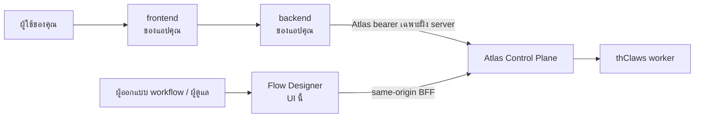

# เรียกใช้ workflow จากแอปพลิเคชันของคุณเอง

คู่มือนี้สำหรับนักพัฒนาที่สร้างแอปพลิเคชัน **บน** workflow ของ Atlas — เว็บฟอร์ม
แอปมือถือ ตัวเชื่อม LINE หรือ n8n หรือ service ภายในองค์กร ไม่ใช่คู่มือผู้ดูแลระบบ
ถ้าต้องการใช้งานและติดตาม workflow ผ่าน UI นี้ ให้ดู
[คู่มือใช้งานผ่านเว็บ](web-user-guide-th.md)

## ใครทำอะไร



| ส่วนประกอบ                 | รับผิดชอบ                                                                        |
| -------------------------- | -------------------------------------------------------------------------------- |
| **Flow Designer** (ตัวนี้) | ออกแบบ ทดสอบ และเฝ้าดู workflow เป็นเครื่องมือผู้ดูแล ไม่ใช่ส่วนหนึ่งของ runtime |
| **backend ของคุณ**         | เก็บ Atlas bearer เรียก Atlas และแปลงผลลัพธ์เข้าสู่ผลิตภัณฑ์ของคุณ               |
| **Atlas**                  | ยืนยันตัวตน สิทธิ์ การจัดเก็บ การประมวลผล artifact trigger และ delivery          |
| **thClaws**                | worker ที่ทำงานจริงในแต่ละ node คุณไม่ต้องเรียกเอง Atlas เป็นผู้ route ให้       |

แอปของคุณคุยกับ **Atlas** ไม่ใช่กับ Flow Designer — Flow Designer เก็บ bearer ของ
ตัวเองไว้ใน httpOnly cookie หลัง server ของมัน ซึ่งมีไว้สำหรับ session ในเบราว์เซอร์
ของตัวเองเท่านั้น ไม่ใช่ API สำหรับผลิตภัณฑ์อื่น

> **ห้ามวาง Atlas bearer ไว้ใน JavaScript ฝั่งเบราว์เซอร์** ใน URL ใน `localStorage`
> หรือในไฟล์แอปมือถือ เพราะทุกอย่างที่รันอยู่บนหน้านั้นอ่านได้ และ token ของ Atlas
> มีสิทธิ์เท่ากับผู้ใช้ที่เป็นเจ้าของ ให้เรียก Atlas จาก backend ที่คุณควบคุมเท่านั้น

## ขอ token

ผู้ดูแลสร้างได้ที่ **Users & Tokens → Mint token** ค่า token ดิบจะแสดงเพียงครั้งเดียว
เพราะ Atlas เก็บแค่ hash ส่งต่อให้ backend ผ่านกลไกความลับตามปกติ (environment
variable หรือ secret manager) และให้ role ที่มีสิทธิ์น้อยที่สุดเท่าที่เริ่ม run ได้

## ห้าคำสั่งที่ต้องใช้

ทั้งหมดด้านล่างเป็น Atlas API ที่มีอยู่จริง ส่วน `$ATLAS_BASE_URL` และ `$ATLAS_TOKEN`
เป็น placeholder ให้แทนค่าของคุณเอง

### 1. เริ่ม run

```bash
curl -sS -X POST "$ATLAS_BASE_URL/api/workflow-runs" \
  -H "Authorization: Bearer $ATLAS_TOKEN" \
  -H "Content-Type: application/json" \
  -d '{"workflow_definition_id":"wfd_...","input":{"topic":"weather"}}'
```

Atlas ตอบ `202` พร้อมข้อมูล run ที่ **ห่ออยู่ใน envelope**:

```json
{ "run": { "id": "wfr_...", "state": "queued" } }
```

ทุก response ด้านล่างห่อแบบเดียวกันหมด ให้อ่าน `body.run.id` ไม่ใช่ `body.id` — นี่คือ
ข้อผิดพลาดที่พบบ่อยที่สุดในการเชื่อมต่อกับ Atlas และมันพังแบบเงียบ ๆ เพราะ loop ที่ poll
โดยอ่าน `body.state` จะได้ `undefined` ตลอดไป

`input` ต้องเป็น JSON **object** ทั้ง object ซ้อน array string number boolean และ
`null` จะถูกเก็บตรงตามที่ส่งไป สิ่งเดียวที่ Atlas เพิ่มอยู่ในซองสงวน `_meta` คือ
เมื่อ workflow มี `default_reply` และผู้เรียกไม่ได้ส่ง `_meta.reply` มา Atlas จะ
merge ให้ ไม่มีการเพิ่ม ลบ หรือแก้ไขฟิลด์ทางธุรกิจใด ๆ

ถ้า workflow มี interface แบบ **declared** (ดูด้านล่าง) request จะรับ
`expected_workflow_version` เป็นทางเลือกเพิ่มเติมได้:

```json
{
  "workflow_definition_id": "wfd_...",
  "input": { "applicant_name": "...", "detail": { "floors": 2 } },
  "expected_workflow_version": 7
}
```

Atlas เทียบค่านี้กับ definition row เดียวกับที่มันโหลดมาเริ่ม run — ไม่มีการ
อ่านแยกต่างหาก จึงไม่มีช่องว่างให้การแก้ไขที่เกิดพร้อมกันหลุดผ่านการตรวจนี้ไปได้
ถ้าไม่ตรงกัน จะตอบ **409** และไม่มีการสร้าง run ขึ้นเลย ส่วน business input ที่
ไม่ผ่าน `input_schema` ที่ประกาศไว้จะตอบ **400** พร้อมระบุชื่อ field หรือ path
ที่ผิด และไม่มีการสร้าง run เช่นกัน ทั้งสองกรณีไม่ควร retry ให้อัตโนมัติ — ให้
ตัดสินใจแล้วส่งใหม่อย่างตั้งใจ โดยอ่าน definition ใหม่ก่อนถ้าเวอร์ชันเปลี่ยนไป
`expected_workflow_version` เป็นทางเลือกล้วน ๆ และไม่มีผลใด ๆ กับ workflow ที่
ไม่มี interface แบบ declared ซึ่งจะทำงานเหมือนเดิมทุกประการ

> **เส้นทางนี้ไม่มี dedupe key** ยิง POST สองครั้งได้ run สองอัน ถ้าผู้เรียกของคุณ
> อาจ retry ให้จัดการ key ฝั่งคุณเอง หรือใช้ trigger ผ่าน
> `POST /api/workflow-triggers/{id}/fire` ซึ่งรองรับ dedupe key — แต่เส้นทาง
> trigger นี้ **ไม่** รองรับ `expected_workflow_version` (ดู "ข้อจำกัดของ
> trigger" ด้านล่าง)

### 2. Poll สถานะ run

```bash
curl -sS "$ATLAS_BASE_URL/api/workflow-runs/$RUN_ID" \
  -H "Authorization: Bearer $ATLAS_TOKEN"
```

ไม่มี event stream ระดับ run การ poll คือวิธีที่รองรับในการติดตาม run
(Atlas มี stream ระดับ _job_ ซึ่งเป็นสิ่งที่ live log ใน UI นี้ใช้ แต่คนละระดับกัน)

| ยังไม่จบ                                                                | สถานะสุดท้าย                       |
| ----------------------------------------------------------------------- | ---------------------------------- |
| `queued`, `running`, `paused`, `waiting_for_human`, `recovery_required` | `succeeded`, `failed`, `cancelled` |

`waiting_for_human` **ไม่ใช่** สถานะสุดท้าย — แปลว่ามี human gate เปิดค้างอยู่
loop ที่ poll ต้องไม่ถือว่าเสร็จแล้ว

### 3. อ่านผลลัพธ์

```bash
curl -sS "$ATLAS_BASE_URL/api/workflow-runs/$RUN_ID/artifacts" \
  -H "Authorization: Bearer $ATLAS_TOKEN"
```

body คือ `{ "artifacts": [ … ] }`

### 4. ตัดสิน approval

```bash
curl -sS -X POST "$ATLAS_BASE_URL/api/approvals/$APPROVAL_ID/approve" \
  -H "Authorization: Bearer $ATLAS_TOKEN"
```

อีกสองแบบคือ `/reject` และ `/choose` โดย gate ที่ประกาศ choice ไว้ต้องใช้ `/choose`
ส่วน gate ที่ไม่มี choice ใช้ `/approve`

### 5. ทางเลือก: ให้ Atlas เรียกกลับ

แทนที่จะ poll ตั้ง reply webhook ไว้ในซองสงวนของ run:

```json
{
  "workflow_definition_id": "wfd_...",
  "input": {
    "topic": "weather",
    "_meta": { "reply": { "mode": "webhook", "callback_url": "https://your.app/hook" } }
  }
}
```

Atlas จะ sign callback ด้วย `X-Atlas-Signature: sha256=<hex>` ซึ่งเป็น HMAC-SHA256 ของ
**raw body** โดยใช้ `ATLAS_SECRET_KEY` ของ Atlas เป็นกุญแจ ให้ตรวจสอบจากไบต์ที่ได้รับมาตรง ๆ
(ถ้า parse เป็น JSON แล้ว serialize ใหม่ ลำดับคีย์และช่องว่างจะเปลี่ยน ทำให้ digest ไม่ตรงตลอดไป)
และให้เปรียบเทียบแบบ constant time แท็บ Integration มีตัวอย่าง Express ที่ใช้งานได้จริงให้

endpoint ของคุณต้องอยู่ใน outbound allowlist ของ Atlas และห้ามฝัง credential ไว้ใน URL
ส่วน workflow ตั้ง `default_reply` ไว้ได้ ผู้เรียกจะได้ไม่ต้องส่ง reply block ซ้ำทุกครั้ง

### 5b. callback ที่เซ็นอีกแบบ: approval ที่ค้างอยู่

run ที่จบไม่ใช่สิ่งเดียวที่ Atlas POST ออกมา ถ้า `policy` ของ workflow มี
`approval_webhook_url` และ `approval_overdue_hours` (หรือ deployment ตั้งค่า `ATLAS_APPROVAL_*`
ไว้) approval ที่ยังค้างเกินแต่ละเกณฑ์จะสร้าง delivery `approval_overdue` ที่เซ็นแล้วขั้นละ
หนึ่งครั้ง — header `X-Atlas-Signature` เดียวกัน ตรวจจาก raw bytes เหมือนกัน allowlist เดียวกัน

body เป็นคนละรูป จึงต้อง **แยกด้วย `event` ก่อนอ่านอย่างอื่น**: การเตือน approval มี object
`approval` กับ `run` ไม่ใช่ `run_id` ที่ระดับบนสุด ผู้รับที่สมมติว่าเป็นรูปแบบ run completion
จะ route ผิด

```json
{
  "event": "approval_overdue",
  "delivery_id": "dlv_apr_apr_123_l2",
  "approval": {
    "id": "apr_123",
    "label": "อนุมัติคำขอจัดซื้อ",
    "reason": "…",
    "choices": [],
    "created_at": "…",
    "age_hours": 130.5,
    "level": 2,
    "threshold_hours": 120
  },
  "run": {
    "id": "wfr_…",
    "node_key": "dept_head_approval",
    "workflow_definition_id": "wfd_…",
    "workflow_name": "อนุมัติคำขอจัดซื้อ"
  },
  "signed_at": "…"
}
```

`level` เริ่มจาก 1 — 1 คือเตือนครั้งแรก ตั้งแต่ 2 ขึ้นไปคือ escalate — ส่วน `run.node_key`
บอกว่า gate ไหนค้าง ให้ route จากสองค่านี้ Atlas บอกแค่ข้อเท็จจริงและไม่ได้เลือกผู้รับให้
กันซ้ำด้วย `delivery_id` ตอบ 2xx ให้เร็วแล้วค่อยแจ้งเตือน และข้าม `event` ที่ไม่รู้จักไป
Atlas มีตัวอย่าง receiver ที่รันได้จริงที่ `poc/approval_reminder_receiver.py`

## สองโหมดของ contract: declared และ observed

แท็บ **Test run → Integration** ของ Flow Designer สร้างเอกสารต่อ workflow ให้ —
ตัวอย่าง cURL/TypeScript/Python ที่ copy ได้ พร้อมดาวน์โหลดเป็น JSON และ Markdown
— ในหนึ่งในสองโหมด และป้ายกำกับของมันจะบอกว่ากำลังทำงานในโหมดไหนอยู่ โหมดที่
workflow แต่ละตัวได้รับเป็นสถานะของ Atlas เองล้วน ๆ ไม่ใช่ทางเลือกฝั่ง client

### Declared · enforced by Atlas

workflow สามารถมี `interface` แบบ **authoritative** ได้ เป็นทางเลือก: มี
`input_schema` ที่เก็บไว้จริง `sample_input` สังเคราะห์ที่เป็นทางเลือก และ
public output key ("อาจเกิดขึ้น" ไม่ใช่การรับประกัน) ที่ผู้เรียกจากภายนอกอ้างอิง
ได้ เมื่อมี interface นี้อยู่ (`schema_version: 1`) Atlas เองจะตรวจสอบทุกการเริ่ม
run โดยตรงกับมัน — ไม่ใช่การอนุมานฝั่ง client แต่อย่างใด Atlas checkout ขั้นต่ำที่
รองรับฟีเจอร์นี้คือ commit `15c4876aa4f86e109a3cc52d6a299f46791053a2`; Atlas
เวอร์ชันเก่ากว่านั้นไม่มีฟิลด์ `interface` เลย และ workflow บน Atlas เวอร์ชันนั้น
จะอยู่ในโหมด Observed เสมอ

```json
{
  "schema_version": 1,
  "input_schema": {
    "type": "object",
    "additionalProperties": false,
    "required": ["applicant_name", "detail"],
    "properties": {
      "applicant_name": { "type": "string", "minLength": 1 },
      "detail": {
        "type": "object",
        "additionalProperties": false,
        "required": ["floors"],
        "properties": { "floors": { "type": "integer", "minimum": 1 } }
      }
    }
  },
  "sample_input": { "applicant_name": "Test Applicant", "detail": { "floors": 2 } },
  "outputs": [{ "key": "assessment_result", "kind": "text" }],
  "primary_output": "assessment_result"
}
```

`input_schema` เป็น profile แบบ **มีขอบเขต** ไม่ใช่ JSON Schema เต็มรูปแบบ — ไม่มี
`$ref` ไม่มี `oneOf`/`anyOf`/`allOf`/`not` ไม่มี `pattern` หรือ `format`
`sample_input` เป็นข้อมูลเชิงเอกสารและข้อมูลทดสอบ Atlas ไม่เคย merge มันเข้า run
จริงเลย ทุก output เป็นเพียง **สิ่งที่อาจเกิดขึ้น** ไม่ใช่การรับประกัน — graph
แตก branch ได้ ดังนั้น output ที่หายไปจึงไม่ทำให้ run ที่สำเร็จอยู่แล้วล้มเหลว และ
ทุก artifact (ไม่ว่าจะประกาศไว้หรือไม่) ยังคงไหลผ่านรูปแบบการ poll และ webhook
เดิมโดยไม่เปลี่ยนแปลง — ไม่มีอะไรเกี่ยวกับ approval, การดึง artifact หรือ reply
webhook ที่เปลี่ยนไปเมื่อ workflow มี interface แบบ declared

สร้าง request ของคุณตรงจาก contract ที่เก็บไว้:

```json
{
  "workflow_definition_id": "wfd_...",
  "input": { "applicant_name": "...", "detail": { "floors": 2 } },
  "expected_workflow_version": 7
}
```

business input ที่ไม่ผ่าน `input_schema` จะตอบ **400** พร้อมระบุ field/path ที่
ผิด ส่วน `expected_workflow_version` ที่เก่าไปแล้วจะตอบ **409** ทั้งสองกรณีไม่มี
การสร้าง run และไม่ควร retry ให้อัตโนมัติทั้งคู่

### Observed · not enforced by Atlas

โหมด fallback สำหรับ workflow ที่ไม่มี interface ใช้งานได้ (ไม่มีเลย หรือมีแต่
เป็น `schema_version` ที่ flow-designer build นี้ไม่รู้จัก) ในกรณีนี้ Atlas
**ไม่ได้เก็บ input schema** เลย มันตรวจเพียงว่า `input` เป็น object และ `_meta`
ถูกรูปแบบเท่านั้น แท็บ Integration จึงอนุมานเท่าที่ทำได้จากข้อความ prompt ใน
graph ที่ save ไว้แทน และผลลัพธ์เป็นเพียง **ข้อมูลประกอบ**:

| บอกได้                                          | บอกไม่ได้                                        |
| ----------------------------------------------- | ------------------------------------------------ |
| graph อ้างถึง path `{input.x}` ใดบ้าง           | แต่ละ path ควรเป็นชนิดข้อมูลอะไร                 |
| node ใดอ่าน path ไหน                            | อันไหนจำเป็นบ้าง เพราะขึ้นกับ branch ที่เดินจริง |
| path ใดที่ **start node** ต้องใช้ก่อนแตก branch | node ถัดไปจะถูกเรียกหรือไม่                      |
| worker **อาจ** เขียน artifact key ใดบ้าง        | จะมี artifact เกิดขึ้นจริงหรือไม่                |
| ชนิด `text`/`json` ที่สังเกตได้ของแต่ละ key     | โครงสร้างเนื้อหาข้างใน artifact ชนิด `json`      |

ให้ถือเป็นจุดตั้งต้นที่ต้องตรวจสอบกับ run จริง ไม่ใช่ schema และมีสองเรื่องที่ควร
วางแผนรับมือ:

- **ปักเวอร์ชันไม่ได้** `POST /api/workflow-runs` รับ `expected_workflow_version`
  เฉพาะในโหมด Declared เท่านั้น workflow แบบ Observed ไม่มีทางตรวจจับการแก้ไขที่
  เกิดขึ้นระหว่างที่คุณอ่าน contract กับตอนเรียก API ได้เลย ต้องประสานงานการแก้
  workflow กับทีมที่เรียกใช้ หรือขอให้ผู้ออกแบบ workflow เพิ่ม interface แบบ
  declared เข้าไป
- **input ที่ขาดจะล้มทีหลัง** Atlas สร้าง run และตอบ `202` ก่อน แล้ว node จึงล้ม
  ตอน render prompt ดังนั้นต้องตรวจสถานะ run ด้วย `202` ไม่ได้แปลว่าสำเร็จ

Flow Designer จะไม่มีการเลื่อน field ที่สังเกตได้ขึ้นเป็น interface แบบ declared
ให้อัตโนมัติ และจะไม่แก้ interface แบบ declared ให้ตรงกับสิ่งที่สังเกตได้จาก
graph เองด้วย — ถ้าทั้งสองฝั่งไม่ตรงกัน panel Application interface ใน editor
จะแสดงคำเตือน drift ระบุ path, node หรือ output ที่ไม่ตรงกันตรง ๆ และการตรวจสอบ
แบบ declared ของ Atlas เองยังเป็นเส้นแบ่งสุดท้ายไม่ว่ากรณีใด

### node แบบ manager (AI Decision)

ตั้งแต่ Atlas แก้ manager-prompt-parity แล้ว (มีผลตั้งแต่ commit
`15c4876aa4f86e109a3cc52d6a299f46791053a2` เป็นต้นไป) prompt ของ manager node
จะถูกแทนค่าเหมือนกับของ worker ทุกประการ — `{input.x}` เป็น reference ที่ใช้งาน
จริง และ fail-closed เมื่อ path ที่อ้างถึงไม่มีอยู่จริงแบบเดียวกัน ในโหมด
**Observed** Flow Designer จึงแสดง `{input.x}` ของ manager เป็น observed input
path ธรรมดา ๆ: บล็อกถ้า manager นั้นเป็น start node ของ graph มิฉะนั้นจะเป็นแค่
คำเตือน ในโหมด **Declared** ไม่มีกฎเฉพาะของ manager เลย — `input_schema` ควบคุม
ทุก path ไม่ว่า node ชนิดไหนจะเป็นผู้ render มันก็ตาม บน Atlas checkout ที่
**เก่ากว่า** การแก้นี้ placeholder เดิมจะถูกส่งถึงโมเดลตรง ๆ และการใส่ค่าไปก็ไม่มี
ผลอะไร ดู [ATLAS_LIMITATIONS.md](../ATLAS_LIMITATIONS.md) สำหรับพฤติกรรมเดิมนั้น

### ข้อจำกัดของ trigger

`POST /api/workflow-triggers/{id}/fire` ไม่รองรับ `expected_workflow_version`
ใน Atlas เวอร์ชันนี้ ไม่ว่าจะเป็น contract mode ไหนก็ตาม trigger ที่มี payload
ตายตัว (เช่น schedule หรือ internal event) ที่ไม่สามารถผ่าน interface แบบ
declared ได้ จะบันทึก trigger event เป็น **failed** และไม่เริ่ม run ใด ๆ — แต่
`next_fire_at`/`last_fired_at` ยังคงเดินหน้าตามปกติ ไม่ทำให้ schedule slot ค้าง
payload ที่เป็น **object** แต่ไม่ผ่านการตรวจสอบยังคงตอบ **202** พร้อม
`run: null` และ `error` ของ event จะระบุเหตุผลไว้ ส่วน payload ที่ **ไม่ใช่
object** จะตอบ 400 ก่อนที่จะมีการบันทึกบัญชี trigger ใด ๆ เกิดขึ้นเลย

### ไฟล์ไม่ใช่ JSON

ฟิลด์ `attachments` ใน `input` เป็นข้อความหรือ metadata เช่นรายชื่อเอกสารหรือ URL
ไม่ใช่ไฟล์ที่อัปโหลด และ `POST /api/workflow-runs/{id}/files` ของ Atlas ต้องมี run
**อยู่ก่อนแล้ว** จึงไม่มีวิธีเตรียมไฟล์ binary ให้ start node ได้ ถ้า workflow ต้องใช้
ไฟล์จริงตั้งแต่ต้น ให้วางไฟล์ไว้ในที่ที่ worker เข้าถึงได้แล้วส่งเป็น reference แทน

## สิ่งที่ระบบไม่ได้ใส่ให้ในตัวอย่าง

ตัวอย่างที่สร้างให้จะไม่มี origin ของ Atlas, bearer, session cookie, callback secret
หรือสิ่งที่พิมพ์ไว้ในแท็บ Input JSON อยู่เลย ทั้งหมดใช้ placeholder ให้เติมค่าจาก
configuration ของคุณเอง และอย่า commit ค่าเหล่านั้นลง repository
