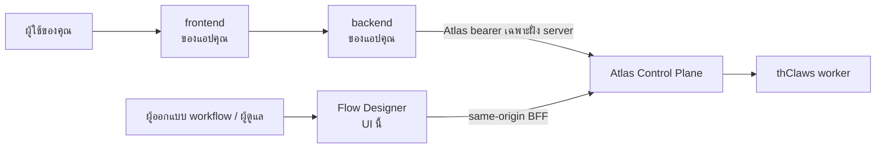

# เรียกใช้ workflow จากแอปพลิเคชันของคุณเอง

คู่มือนี้สำหรับนักพัฒนาที่สร้างแอปพลิเคชัน **บน** workflow ของ Atlas — เว็บฟอร์ม
แอปมือถือ ตัวเชื่อม LINE หรือ n8n หรือ service ภายในองค์กร ไม่ใช่คู่มือผู้ดูแลระบบ
ถ้าต้องการใช้งานและติดตาม workflow ผ่าน UI นี้ ให้ดู
[คู่มือใช้งานผ่านเว็บ](web-user-guide-th.md)

## ใครทำอะไร



| ส่วนประกอบ                 | รับผิดชอบ                                                                        |
| -------------------------- | -------------------------------------------------------------------------------- |
| **Flow Designer** (ตัวนี้) | ออกแบบ ทดสอบ และเฝ้าดู workflow เป็นเครื่องมือผู้ดูแล ไม่ใช่ส่วนหนึ่งของ runtime |
| **backend ของคุณ**         | เก็บ Atlas bearer เรียก Atlas และแปลงผลลัพธ์เข้าสู่ผลิตภัณฑ์ของคุณ               |
| **Atlas**                  | ยืนยันตัวตน สิทธิ์ การจัดเก็บ การประมวลผล artifact trigger และ delivery          |
| **thClaws**                | worker ที่ทำงานจริงในแต่ละ node คุณไม่ต้องเรียกเอง Atlas เป็นผู้ route ให้       |

แอปของคุณคุยกับ **Atlas** ไม่ใช่กับ Flow Designer — Flow Designer เก็บ bearer ของ
ตัวเองไว้ใน httpOnly cookie หลัง server ของมัน ซึ่งมีไว้สำหรับ session ในเบราว์เซอร์
ของตัวเองเท่านั้น ไม่ใช่ API สำหรับผลิตภัณฑ์อื่น

> **ห้ามวาง Atlas bearer ไว้ใน JavaScript ฝั่งเบราว์เซอร์** ใน URL ใน `localStorage`
> หรือในไฟล์แอปมือถือ เพราะทุกอย่างที่รันอยู่บนหน้านั้นอ่านได้ และ token ของ Atlas
> มีสิทธิ์เท่ากับผู้ใช้ที่เป็นเจ้าของ ให้เรียก Atlas จาก backend ที่คุณควบคุมเท่านั้น

## ขอ token

ผู้ดูแลสร้างได้ที่ **Users & Tokens → Mint token** ค่า token ดิบจะแสดงเพียงครั้งเดียว
เพราะ Atlas เก็บแค่ hash ส่งต่อให้ backend ผ่านกลไกความลับตามปกติ (environment
variable หรือ secret manager) และให้ role ที่มีสิทธิ์น้อยที่สุดเท่าที่เริ่ม run ได้

## ห้าคำสั่งที่ต้องใช้

ทั้งหมดด้านล่างเป็น Atlas API ที่มีอยู่จริง ส่วน `$ATLAS_BASE_URL` และ `$ATLAS_TOKEN`
เป็น placeholder ให้แทนค่าของคุณเอง

### 1. เริ่ม run

```bash
curl -sS -X POST "$ATLAS_BASE_URL/api/workflow-runs" \
  -H "Authorization: Bearer $ATLAS_TOKEN" \
  -H "Content-Type: application/json" \
  -d '{"workflow_definition_id":"wfd_...","input":{"topic":"weather"}}'
```

Atlas ตอบ `202` พร้อมข้อมูล run ที่ **ห่ออยู่ใน envelope**:

```json
{ "run": { "id": "wfr_...", "state": "queued" } }
```

ทุก response ด้านล่างห่อแบบเดียวกันหมด ให้อ่าน `body.run.id` ไม่ใช่ `body.id` — นี่คือ
ข้อผิดพลาดที่พบบ่อยที่สุดในการเชื่อมต่อกับ Atlas และมันพังแบบเงียบ ๆ เพราะ loop ที่ poll
โดยอ่าน `body.state` จะได้ `undefined` ตลอดไป

`input` ต้องเป็น JSON **object** ทั้ง object ซ้อน array string number boolean และ
`null` จะถูกเก็บตรงตามที่ส่งไป สิ่งเดียวที่ Atlas เพิ่มอยู่ในซองสงวน `_meta` คือ
เมื่อ workflow มี `default_reply` และผู้เรียกไม่ได้ส่ง `_meta.reply` มา Atlas จะ
merge ให้ ไม่มีการเพิ่ม ลบ หรือแก้ไขฟิลด์ทางธุรกิจใด ๆ

> **เส้นทางนี้ไม่มี dedupe key** ยิง POST สองครั้งได้ run สองอัน ถ้าผู้เรียกของคุณ
> อาจ retry ให้จัดการ key ฝั่งคุณเอง หรือใช้ trigger ผ่าน
> `POST /api/workflow-triggers/{id}/fire` ซึ่งรองรับ dedupe key

### 2. Poll สถานะ run

```bash
curl -sS "$ATLAS_BASE_URL/api/workflow-runs/$RUN_ID" \
  -H "Authorization: Bearer $ATLAS_TOKEN"
```

ไม่มี event stream ระดับ run การ poll คือวิธีที่รองรับในการติดตาม run
(Atlas มี stream ระดับ _job_ ซึ่งเป็นสิ่งที่ live log ใน UI นี้ใช้ แต่คนละระดับกัน)

| ยังไม่จบ                                                                | สถานะสุดท้าย                       |
| ----------------------------------------------------------------------- | ---------------------------------- |
| `queued`, `running`, `paused`, `waiting_for_human`, `recovery_required` | `succeeded`, `failed`, `cancelled` |

`waiting_for_human` **ไม่ใช่** สถานะสุดท้าย — แปลว่ามี human gate เปิดค้างอยู่
loop ที่ poll ต้องไม่ถือว่าเสร็จแล้ว

### 3. อ่านผลลัพธ์

```bash
curl -sS "$ATLAS_BASE_URL/api/workflow-runs/$RUN_ID/artifacts" \
  -H "Authorization: Bearer $ATLAS_TOKEN"
```

body คือ `{ "artifacts": [ … ] }`

### 4. ตัดสิน approval

```bash
curl -sS -X POST "$ATLAS_BASE_URL/api/approvals/$APPROVAL_ID/approve" \
  -H "Authorization: Bearer $ATLAS_TOKEN"
```

อีกสองแบบคือ `/reject` และ `/choose` โดย gate ที่ประกาศ choice ไว้ต้องใช้ `/choose`
ส่วน gate ที่ไม่มี choice ใช้ `/approve`

### 5. ทางเลือก: ให้ Atlas เรียกกลับ

แทนที่จะ poll ตั้ง reply webhook ไว้ในซองสงวนของ run:

```json
{
  "workflow_definition_id": "wfd_...",
  "input": {
    "topic": "weather",
    "_meta": { "reply": { "mode": "webhook", "callback_url": "https://your.app/hook" } }
  }
}
```

Atlas จะ sign callback ด้วย `X-Atlas-Signature: sha256=<hex>` ซึ่งเป็น HMAC-SHA256 ของ
**raw body** โดยใช้ `ATLAS_SECRET_KEY` ของ Atlas เป็นกุญแจ ให้ตรวจสอบจากไบต์ที่ได้รับมาตรง ๆ
(ถ้า parse เป็น JSON แล้ว serialize ใหม่ ลำดับคีย์และช่องว่างจะเปลี่ยน ทำให้ digest ไม่ตรงตลอดไป)
และให้เปรียบเทียบแบบ constant time แท็บ Integration มีตัวอย่าง Express ที่ใช้งานได้จริงให้

endpoint ของคุณต้องอยู่ใน outbound allowlist ของ Atlas และห้ามฝัง credential ไว้ใน URL
ส่วน workflow ตั้ง `default_reply` ไว้ได้ ผู้เรียกจะได้ไม่ต้องส่ง reply block ซ้ำทุกครั้ง

## Observed contract คืออะไร

แท็บ **Test run → Integration** ของ Flow Designer สร้างเอกสารต่อ workflow ให้ —
ตัวอย่าง cURL/TypeScript/Python ที่ copy ได้ พร้อมดาวน์โหลดเป็น JSON และ Markdown
เอกสารนั้นมีป้ายกำกับว่า **Observed · not enforced by Atlas** และป้ายนั้นตรงตามจริง

ปัจจุบัน Atlas **ไม่ได้เก็บ input schema** ของ workflow เลย มันตรวจเพียงว่า `input`
เป็น object และ `_meta` ถูกรูปแบบเท่านั้น แท็บ Integration จึงอนุมานเท่าที่ทำได้จาก
ข้อความ prompt ใน graph ที่ save ไว้ และผลลัพธ์เป็นเพียง **ข้อมูลประกอบ**:

| บอกได้                                          | บอกไม่ได้                                        |
| ----------------------------------------------- | ------------------------------------------------ |
| graph อ้างถึง path `{input.x}` ใดบ้าง           | แต่ละ path ควรเป็นชนิดข้อมูลอะไร                 |
| node ใดอ่าน path ไหน                            | อันไหนจำเป็นบ้าง เพราะขึ้นกับ branch ที่เดินจริง |
| path ใดที่ **start node** ต้องใช้ก่อนแตก branch | node ถัดไปจะถูกเรียกหรือไม่                      |
| worker **อาจ** เขียน artifact key ใดบ้าง        | จะมี artifact เกิดขึ้นจริงหรือไม่                |
| ชนิด `text`/`json` ที่สังเกตได้ของแต่ละ key     | โครงสร้างเนื้อหาข้างใน artifact ชนิด `json`      |

ให้ถือเป็นจุดตั้งต้นที่ต้องตรวจสอบกับ run จริง ไม่ใช่ schema และมีสองเรื่องที่ควร
วางแผนรับมือ:

- **ปักเวอร์ชันไม่ได้** `POST /api/workflow-runs` ไม่มี `expected_workflow_version`
  ถ้ามีการแก้ workflow ระหว่างที่คุณอ่าน contract กับตอนเรียก API จะตรวจจับไม่ได้
  ต้องประสานงานการแก้ workflow กับทีมที่เรียกใช้
- **input ที่ขาดจะล้มทีหลัง** Atlas สร้าง run และตอบ `202` ก่อน แล้ว node จึงล้ม
  ตอน render prompt ดังนั้นต้องตรวจสถานะ run ด้วย `202` ไม่ได้แปลว่าสำเร็จ

### node แบบ manager (AI Decision)

Atlas สร้าง prompt ของ manager node โดยไม่แทนค่า `{input.x}` ข้อความ placeholder
จึงถูกส่งถึงโมเดลตรง ๆ Flow Designer จะรายงานกรณีนี้เป็นคำเตือน และตั้งใจ **ไม่**
แสดงมันเป็น run input เพราะการใส่ค่าไปก็ไม่มีผลอะไร ดู
[ATLAS_LIMITATIONS.md](../ATLAS_LIMITATIONS.md)

### ไฟล์ไม่ใช่ JSON

ฟิลด์ `attachments` ใน `input` เป็นข้อความหรือ metadata เช่นรายชื่อเอกสารหรือ URL
ไม่ใช่ไฟล์ที่อัปโหลด และ `POST /api/workflow-runs/{id}/files` ของ Atlas ต้องมี run
**อยู่ก่อนแล้ว** จึงไม่มีวิธีเตรียมไฟล์ binary ให้ start node ได้ ถ้า workflow ต้องใช้
ไฟล์จริงตั้งแต่ต้น ให้วางไฟล์ไว้ในที่ที่ worker เข้าถึงได้แล้วส่งเป็น reference แทน

## สิ่งที่ระบบไม่ได้ใส่ให้ในตัวอย่าง

ตัวอย่างที่สร้างให้จะไม่มี origin ของ Atlas, bearer, session cookie, callback secret
หรือสิ่งที่พิมพ์ไว้ในแท็บ Input JSON อยู่เลย ทั้งหมดใช้ placeholder ให้เติมค่าจาก
configuration ของคุณเอง และอย่า commit ค่าเหล่านั้นลง repository
